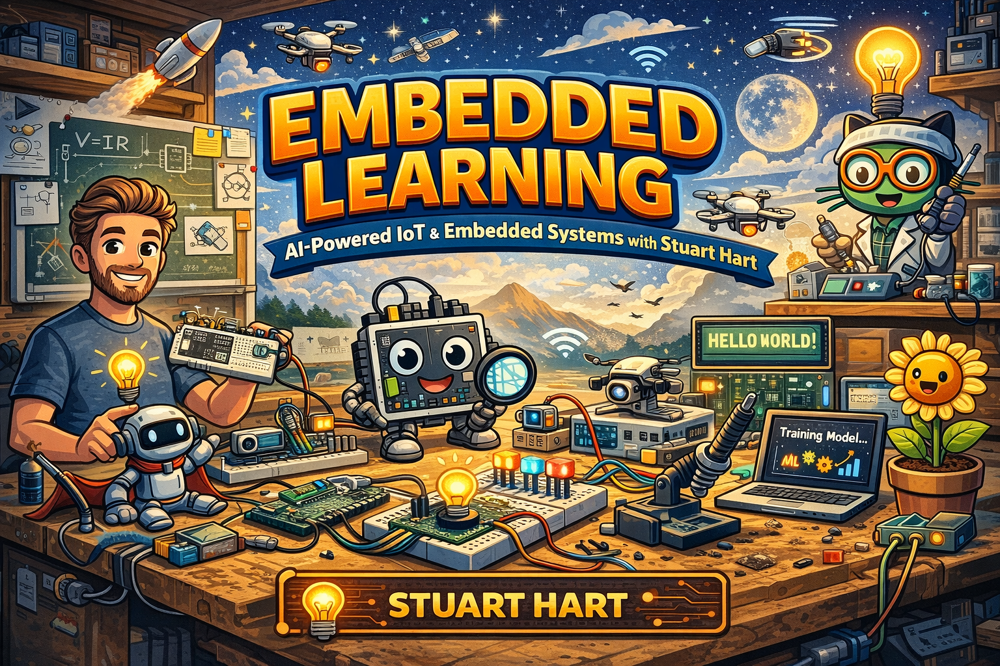

  
  
  
  

# 🔌 Embedded C++ Learning Path

**A hands-on, zero-hardware curriculum for learning embedded systems programming.**

19 progressive lessons across 4 microcontroller platforms — all runnable in your browser using the free [Wokwi](https://wokwi.com) simulator. No dev boards, no soldering, no toolchain headaches. Just code, circuits, and deeply annotated explanations.

> *The comments in the code ARE the lesson.* Each sketch explains not just **what** the code does, but **why** — down to the register level, with cross-platform comparisons throughout.

---

## 🚀 Getting Started

1. Head to **[wokwi.com](https://wokwi.com)** and create a new project
2. Select the board for your lesson (ESP32 · STM32 Nucleo · Arduino Uno · Raspberry Pi Pico)
3. Paste the lesson's `sketch.ino` into the code editor
4. Switch to the diagram tab and paste `diagram.json`
5. Hit **Play** ▶ and start learning

No account required. No installs. Works on any machine with a browser.

---

## 📚 Curriculum

### 🟢 ESP32 — The IoT Workhorse
*Xtensa LX6 · 240 MHz · Dual Core · WiFi + Bluetooth · 520 KB SRAM*

| # | Lesson | Concepts |
|:---:|--------|----------|
| 01 | [Blink](01-blink/) | GPIO output · register-level vs Arduino abstractions · timing |
| 02 | [Button + LED](02-button-led/) | GPIO input · pull-up resistors · debouncing · non-blocking timing |
| 03 | [Serial / UART](03-serial-uart/) | UART protocol · baud rate · ADC · command parsing |
| 04 | [PWM LED](04-pwm-led/) | Pulse Width Modulation · duty cycle · LEDC peripheral |
| 05 | [I2C Sensor](05-i2c-sensor/) | I2C bus · device addresses · DHT22 temperature/humidity |
| 06 | [Interrupts](06-interrupt/) | Hardware interrupts · ISRs · `volatile` · `IRAM_ATTR` · critical sections |

### 🔵 STM32 — The Industry Standard
*Cortex-M0+ · 48 MHz · Clock Gating · HAL/LL Drivers · AHB/APB Bus*

| # | Lesson | Concepts |
|:---:|--------|----------|
| 07 | [GPIO & HAL](07-gpio-stm32/) | HAL vs direct registers · clock tree · MODER/BSRR · peripheral clocks |
| 08 | [Timers & PWM](08-timer-pwm-stm32/) | Hardware timers · prescaler/ARR/CCR · capture/compare · encoder mode |
| 09 | [ADC with DMA](09-adc-dma-stm32/) | DMA transfers · scan mode · continuous conversion · zero-CPU-cost sampling |
| 10 | [I2C OLED](10-i2c-oled-stm32/) | I2C on STM32 · SSD1306 display · address scanning · raw byte commands |

### 🟡 AVR (Arduino Uno) — The Bare-Metal Classic
*ATmega328P · 8-bit · 16 MHz · 2 KB RAM · 32 KB Flash*

| # | Lesson | Concepts |
|:---:|--------|----------|
| 11 | [Port Manipulation](11-port-manipulation-avr/) | DDRx/PORTx/PINx registers · bitwise ops · single-cycle I/O |
| 12 | [Timer Interrupts](12-timer-interrupt-avr/) | Timer1 CTC mode · prescalers · OCR1A · precise periodic interrupts |
| 13 | [EEPROM](13-eeprom-avr/) | Non-volatile storage · wear levelling · 100K write-cycle endurance |
| 14 | [Watchdog Timer](14-watchdog-avr/) | WDT reset · hang recovery · WDTCSR · production reliability |

### 🟣 Raspberry Pi Pico — The Modern Newcomer
*RP2040 · Dual Cortex-M0+ · 133 MHz · PIO · 264 KB SRAM*

| # | Lesson | Concepts |
|:---:|--------|----------|
| 15 | [Dual Core](15-dual-core-pico/) | Multicore execution · `setup1()`/`loop1()` · hardware FIFO mailbox |
| 16 | [PIO](16-pio-pico/) | Programmable I/O state machines · WS2812 NeoPixels · custom protocols |
| 17 | [ADC & Temp Sensor](17-adc-temp-pico/) | Built-in temperature sensor · 12-bit ADC · oversampling techniques |
| 18 | [PWM Slices](18-pwm-pico/) | 8 hardware PWM slices · RGB LED · HSV colour cycling |

### 🔴 Cross-Platform Capstone

| # | Lesson | Concepts |
|:---:|--------|----------|
| 19 | [Comparison](19-comparison/) | The same task on all four platforms — GPIO, debounce, interrupts, timing, and memory models compared side-by-side |

---

## 🧠 What You'll Learn

By the end of this curriculum, you'll understand:

- **GPIO** — How pins physically switch between voltage levels
- **Registers** — Reading/writing hardware control registers directly
- **Communication protocols** — UART, I2C, SPI fundamentals
- **Interrupts** — Hardware event handling without polling
- **Timers & PWM** — Precise timing, waveform generation, motor/LED control
- **DMA** — Offloading data transfers from the CPU
- **Memory constraints** — Working within 2 KB RAM (AVR) to 520 KB (ESP32)
- **Multicore** — Parallel execution on dual-core MCUs
- **PIO** — Custom hardware I/O protocols (RP2040)
- **Watchdog & EEPROM** — Production reliability and persistence
- **Platform differences** — Why the same task looks different on ARM vs AVR vs Xtensa

---

## 🏭 Industry Platforms Not Covered

These MCU families are critical in industry but aren't available in Wokwi:

| Platform | Why It Matters |
|----------|---------------|
| **Nordic nRF52/53/91** | Dominant in Bluetooth Low Energy — wearables, asset trackers, hearing aids. nRF9160 adds cellular (LTE-M/NB-IoT). |
| **TI MSP430** | Ultra-low-power king — µA-level consumption for battery-powered metering, medical devices, and energy harvesting. |
| **Microchip PIC** | Decades of legacy across 8/16/32-bit families — automotive, appliances, industrial control. Billions shipped. |
| **NXP LPC / i.MX RT** | Automotive (CAN/LIN), NFC/RFID, and high-performance real-time. i.MX RT crossover processors blur the MCU/MPU line. |
| **Renesas RA/RX/RL78** | #1 MCU vendor by automotive market share. Cortex-M based RA family. Ubiquitous in Japanese automotive and industrial. |

---

## 🤝 Contributing

Found a bug in a diagram? Want to add a lesson for a new peripheral? PRs are welcome.

Each lesson should follow the established format:
- `sketch.ino` — Heavily commented code (the comments *are* the lesson)
- `diagram.json` — Valid Wokwi circuit diagram
- One clear concept per lesson, building on previous ones

---

## 📄 License

MIT License — see [LICENSE](LICENSE) for details.

**Created by [Stuart Hart](mailto:stuarthart@msn.com)** — built as an open educational resource for anyone learning embedded systems.

---

  <i>From blinking an LED to programming hardware state machines — one lesson at a time.</i>

